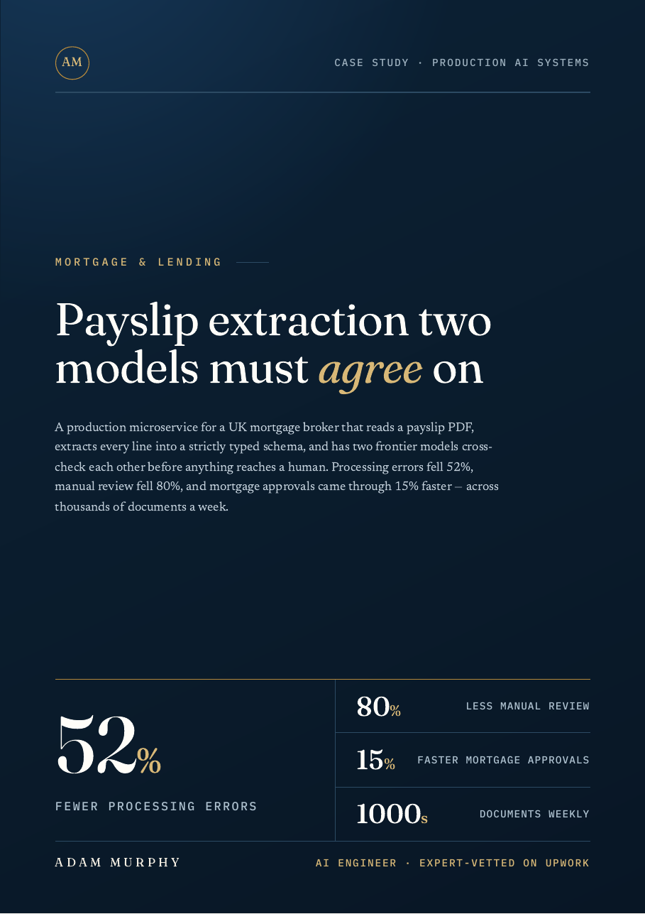
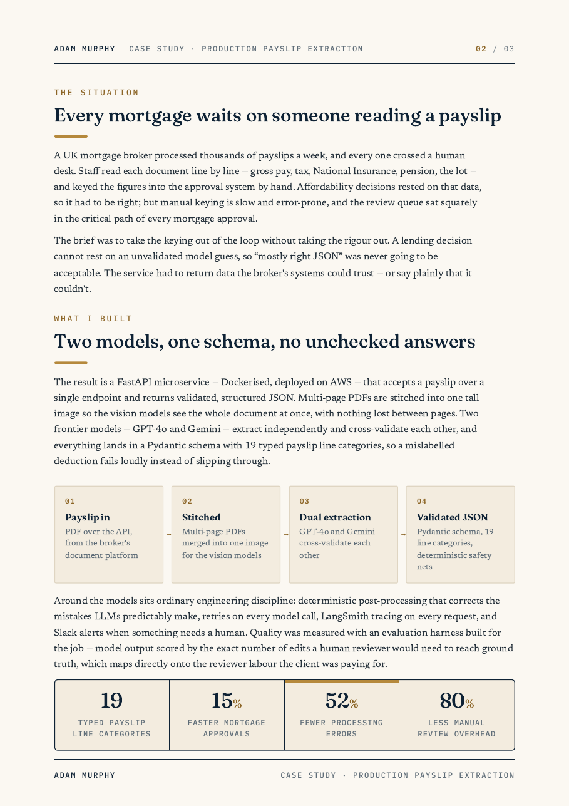
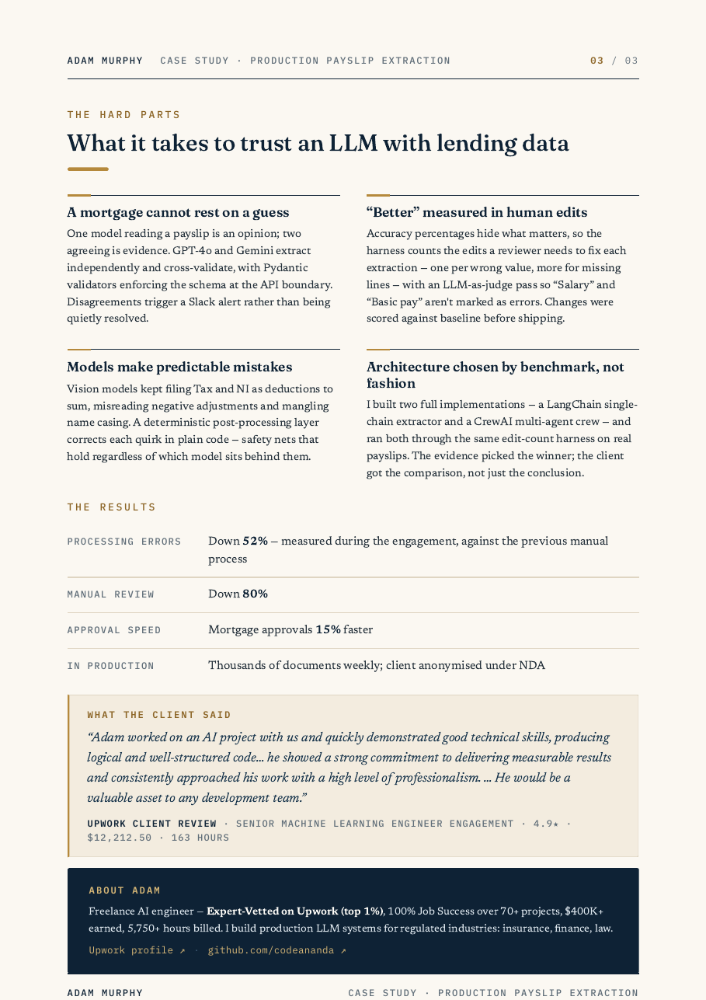

# Payslip extraction two models must agree on

**A production microservice for a UK mortgage broker that reads a payslip PDF, extracts every line into a strictly typed schema, and has two frontier models cross-check each other before anything reaches a human.**

## At a glance

| Value | What it is |
|---|---|
| 52% | Fewer processing errors |
| 80% | Less manual review |
| 15% | Faster mortgage approvals |
| 1000s | Documents weekly |

## The situation

A UK mortgage broker processed thousands of payslips a week, and every one crossed a human desk. Staff read each document line by line — gross pay, tax, National Insurance, pension, the lot — and keyed the figures into the approval system by hand.

Affordability decisions rested on that data, so it had to be right; but manual keying is slow and error-prone, and the review queue sat squarely in the critical path of every mortgage approval.

The brief was to take the keying out of the loop without taking the rigour out. A lending decision cannot rest on an unvalidated model guess, so "mostly right JSON" was never going to be acceptable. The service had to return data the broker's systems could trust — or say plainly that it couldn't.

## What I built

The result is a FastAPI microservice — Dockerised, deployed on AWS — that accepts a payslip over a single endpoint and returns validated, structured JSON. Multi-page PDFs are stitched into one tall image so the vision models see the whole document at once, with nothing lost between pages. Two frontier models — GPT-4o and Gemini — extract independently and cross-validate each other, and everything lands in a Pydantic schema with 19 typed payslip line categories, so a mislabelled deduction fails loudly instead of slipping through.

| Step | What happens |
|---|---|
| Payslip in | PDF over the API, from the broker's document platform |
| Stitched | Multi-page PDFs merged into one image for the vision models |
| Dual extraction | GPT-4o and Gemini cross-validate each other |
| Validated JSON | Pydantic schema, 19 line categories, deterministic safety nets |

Around the models sits ordinary engineering discipline: deterministic post-processing that corrects the mistakes LLMs predictably make, retries on every model call, LangSmith tracing on every request, and Slack alerts when something needs a human. Quality was measured with an evaluation harness built for the job — model output scored by the exact number of edits a human reviewer would need to reach ground truth, which maps directly onto the reviewer labour the client was paying for.

## The hard parts: what it takes to trust an LLM with lending data

### A mortgage cannot rest on a guess

One model reading a payslip is an opinion; two agreeing is evidence. GPT-4o and Gemini extract independently and cross-validate, with Pydantic validators enforcing the schema at the API boundary. Disagreements trigger a Slack alert rather than being quietly resolved.

### "Better" measured in human edits

Accuracy percentages hide what matters, so the harness counts the edits a reviewer needs to fix each extraction — one per wrong value, more for missing lines — with an LLM-as-judge pass so "Salary" and "Basic pay" aren't marked as errors. Changes were scored against baseline before shipping.

### Models make predictable mistakes

Vision models kept filing Tax and NI as deductions to sum, misreading negative adjustments and mangling name casing. A deterministic post-processing layer corrects each quirk in plain code — safety nets that hold regardless of which model sits behind them.

### Architecture chosen by benchmark, not fashion

I built two full implementations — a LangChain single-chain extractor and a CrewAI multi-agent crew — and ran both through the same edit-count harness on real payslips. The evidence picked the winner; the client got the comparison, not just the conclusion.

## Results

| Metric | Outcome |
|---|---|
| Processing errors | Down 52% — measured during the engagement, against the previous manual process |
| Manual review | Down 80% |
| Approval speed | Mortgage approvals 15% faster |
| In production | Thousands of documents weekly; client anonymised under NDA |

## What the client said

> "Adam worked on an AI project with us and quickly demonstrated good technical skills, producing logical and well-structured code… he showed a strong commitment to delivering measurable results and consistently approached his work with a high level of professionalism. … He would be a valuable asset to any development team."

— Upwork client review, Senior Machine Learning Engineer engagement · 4.9★ · $12,212.50 · 163 hours

## The full case study

A designed PDF version of this case study is in this repo: [06-payslip-extraction.pdf](06-payslip-extraction.pdf).

---

## About Adam

Freelance AI engineer — Expert-Vetted on Upwork (top 1%), 100% Job Success over 70+ projects, $400K+ earned, 5,750+ hours billed. I build production LLM systems for regulated industries: insurance, finance, law.

- [Upwork profile](https://www.upwork.com/freelancers/~01153ca9fd0099730e)
- [GitHub](https://github.com/codeananda)
